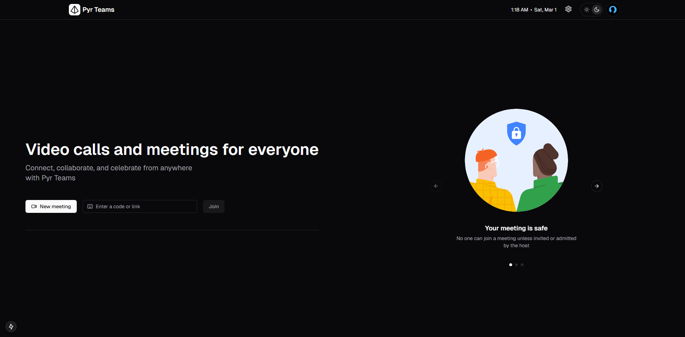
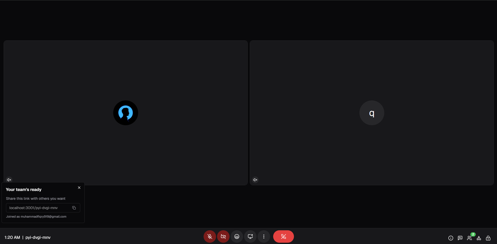

## Overview
Implementing peer-to-peer (P2P) video conferencing. PeerJS is a JavaScript library that simplifies WebRTC connections,
This makes it an efficient and scalable solution for real-time video conferencing applications.

[]()

## Key features
- Multi-User Conference
- Picture-in-Picture Mode
- Share Screen
- In-Call Messaging
- Host Controls
- Custom Signaling Server

## How to run
- Clone the repo
- Go to server-side directory
- Copy each .env.example `cp env.example .env`
- Start server-side on **http-server** `go run main.go`
- Start client-side on **web-ui** `npm run dev`
- Make sure your install require dependencies & add supabase key on .env

```env
SUPABASE_URL=
SUPABASE_ANON_KEY=
```
You can see on official supabase docs [here](https://supabase.com/docs)

[]()